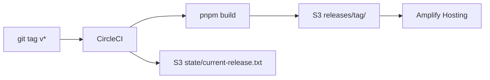

# tanstack-amplify-s3

TanStack Router + Vite の SPA を CircleCI から S3 経由で Amplify Hosting にデプロイするサンプル。

## リポジトリ構成

```
.
├── web/              # フロントエンド（TanStack Router + Vite）
├── cdk/              # S3 成果物バケット（AWS CDK）
└── .circleci/        # デプロイ・ロールバックパイプライン
```

| ディレクトリ | 説明 | 詳細 |
|---|---|---|
| [`web/`](web/) | SPA アプリ | [web/README.md](web/README.md) |
| [`cdk/`](cdk/) | Amplify 用 S3 バケット + バケットポリシー | [cdk/README.md](cdk/README.md) |
| [`.circleci/`](.circleci/) | タグ `v*` トリガーの CD / ロールバック | 下記「デプロイ」参照 |

## アーキテクチャ



1. CircleCI が `web/dist/` をビルド
2. 成果物を `s3://{BUCKET_NAME}/releases/{tag}/` に配置
3. `aws amplify start-deployment` で Amplify が S3 から取得してホスティング
4. 現在のリリースバージョンを `state/current-release.txt` に記録

Amplify アプリ本体は CDK 外で AWS CLI から作成する。CDK は S3 バケットと Amplify が読み取れるバケットポリシーのみ管理する。

## 初回セットアップ

### 1. Amplify アプリを作成

```bash
export AWS_REGION=ap-northeast-1

aws amplify create-app \
  --name <app-name> \
  --platform WEB \
  --custom-rules source="</^[^.]+$|\\.(?!(css|gif|ico|jpg|js|png|txt|svg|woff|woff2|ttf|map|json|webp)$)([^.]+$)/>",target=/index.html,status=200

export APP_ID=<app-id>

aws amplify create-branch \
  --app-id "$APP_ID" \
  --branch-name main \
  --stage PRODUCTION
```

### 2. CDK で S3 バケットをデプロイ

```bash
cd cdk
pnpm install
npx cdk deploy -c amplifyAppId="$APP_ID" -c branchName=main
```

詳細は [cdk/README.md](cdk/README.md) を参照。

### 3. CircleCI コンテキスト `aws-oidc` を設定

| 変数 | 説明 |
|---|---|
| `AWS_ROLE_ARN` | OIDC 用 IAM ロール ARN |
| `AWS_REGION` | Amplify アプリと同じリージョン（例: `ap-northeast-1`） |
| `APP_ID` | Amplify アプリ ID |
| `BUCKET_NAME` | CDK 出力の `BucketName` |
| `BRANCH_NAME` | Amplify ブランチ名（通常 `main`） |

`AWS_REGION` が Amplify アプリのリージョンと一致しないと `App not found` になる。

## ローカル開発

```bash
cd web
corepack enable
pnpm install
pnpm run dev
```

## デプロイ

タグ `v*` を push すると [`.circleci/config.yml`](.circleci/config.yml) の deploy workflow が起動する。

```bash
git tag v1.0.0
git push origin v1.0.0
```

ロールバックは [`.circleci/rollback.yml`](.circleci/rollback.yml) を CircleCI の setup パイプラインとして登録し、過去の `releases/{version}/` を指定して実行する。

## クリーンアップ

リソースを削除する場合:

```bash
# S3 バケットを空にする（中身があると destroy できない）
aws s3 rm s3://<bucket-name> --recursive

# CDK スタック削除
cd cdk
npx cdk destroy AmplifyS3DeployBucketStack \
  -c amplifyAppId=<APP_ID> -c branchName=main --force

# Amplify アプリ削除
aws amplify delete-app --app-id <APP_ID> --region <region>
```
